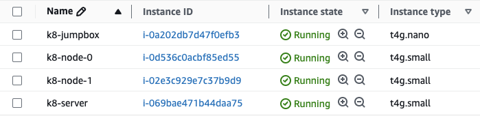

# Bootstrapping a K8 Cluster from Scratch

I recently started a new role as a Data Platform Engineer at Kraken, where we use Kubernetes on Amazon Elastic Kubernetes Service (EKS) for most of our data platform tooling (e.g. Airflow, dbt Core). To make sure my Kubernetes skills were up to scratch, I set out to bootstrap my own cluster using a set of EC2 instances by following this repo: [kubernetes-the-hard-way](https://github.com/kelseyhightower/kubernetes-the-hard-way/tree/master).

## Creating the virtual machines

The cluster is made up of four ARM64 virtual machines running Debian 12:
1. `jumpbox` (Administration host)
2. `server` (Kubernetes server)
3. `node-0` (Kubernetes worker node)
4. `node-1` (Kubernetes worker node)
 I created a Terraform workspace – [jack-white9/k8-cluster-bootstrap/terraform](https://github.com/jack-white9/k8-cluster-bootstrap/tree/main/terraform) – to provision the VMs as EC2 instances, along with a VPC and security group (with an ingress SSH rule). To deploy the resources, I simply applied my Terraform configuration while authenticated to my AWS account.
```bash
terraform apply
```



## Setting up the Jumpbox

One of the VMs has been set up as a jumpbox, which will be used as the home base to run commands that interact with the cluster. To set up the jumpbox, I connected to the `jumpbox` instance.
```bash
ssh -i k8-jumpbox-key-pair.pem admin@<public-ipv4-address>
```

From there, I went through the following actions to install some required tooling:
1. Installing basic packages (`wget`, `curl`, `vim`, `openssl`, `git`)
```bash
sudo apt-get update &&\
sudo apt-get -y install wget curl vim openssl git
```
2. Cloning the utilities repo (includes binaries and services)
```bash
git clone --depth 1 \
https://github.com/kelseyhightower/kubernetes-the-hard-way.git && \
cd kubernetes-the-hard-way
```
3. Downloading Kubernetes binaries (including `kubectl`, `kube-apiserver`, `kube-controller-manager`, and others)
```bash
wget -q --show-progress \
  --https-only \
  --timestamping \
  -P downloads \
  -i downloads.txt
```
4. Adding the `kubectl` binary to `/usr/local/bin`
```bash
chmod +x downloads/kubectl && cp downloads/kubectl /usr/local/bin/
```

Finally, I verified the `kubectl` installation before moving on.
```bash
kubectl version --client
```

```
Client Version: v1.28.3
Kustomize Version: v5.0.4-0.20230601165947-6ce0bf390ce3
```

## Configuring Compute Resources

### Creating a "database"

To get started, I created a simple "database" containing the `IPV4_ADDRESS`, `FQDN`, `HOSTNAME`, and `POD_SUBNET` of each machine. I created `machines.txt` with the following information *(IP addresses have been masked here for security purposes)*:
```
XXX.XXX.XXX.XXX server.kubernetes.local server  
XXX.XXX.XXX.XXX node-0.kubernetes.local node-0 10.200.0.0/24
XXX.XXX.XXX.XXX node-1.kubernetes.local node-1 10.200.1.0/24
```

### Enabling SSH access

Firstly, I enabled root access to `server`, `node-0`, and `node-1` *(not best practice, but will make life a little easier for the sake of this exercise)* by running the following command inside each instance:
```bash
sed -i \
  's/^#PermitRootLogin.*/PermitRootLogin yes/' \
  /etc/ssh/sshd_config
```

Next, I went ahead and generated an SSH key in `jumpbox` that will be used to connect to each machine.
```bash
ssh-keygen
```

Once the SSH key was generated, I copied the contents of the public key (`~/.ssh/id_rsa.pub`) and appended it to `~/.ssh/authorized_keys` in each machine (`server`, `node-0`, and `node-1`).

Finally, to confirm that SSH access from `jumpbox` to each machine was working, I ran the following command:
```bash
while read IP FQDN HOST SUBNET; do 
  ssh -n root@${IP} uname -o -m
done < machines.txt
```

```
aarch64 GNU/Linux
aarch64 GNU/Linux
aarch64 GNU/Linux
```

### Configuring hostnames

Hostnames make communication within the cluster more manageable by providing human-readable names instead of IP addresses. To add hostnames to each of the machines, I ran the following command from `jumpbox`, which appends each respective hostname to `/etc/hosts` and adds the hostname to `hostnamectl`.
```bash
while read IP FQDN HOST SUBNET; do
    CMD="echo '127.0.1.1	${FQDN} ${HOST}' >> /etc/hosts"
    ssh -n root@${IP} "$CMD"
    ssh -n root@${IP} hostnamectl hostname ${HOST}
done < machines.txt
```

Once added, I verified the hostnames had been set correctly.
```bash
while read IP FQDN HOST SUBNET; do
  ssh -n root@${IP} hostname --fqdn
done < machines.txt
```

```
server.kubernetes.local
node-0.kubernetes.local
node-1.kubernetes.local
```

### Configuring DNS

For the final step of configuring the compute resources, I mapped each hostname to their respective IPv4 address in `/etc/hosts` to allow each machine to be reachable using their hostname (`server`, `node-0`, or `node-1`).

To do this, I started by creating a temporary DNS `hosts` file.
```bash
while read IP FQDN HOST SUBNET; do
    ENTRY="${IP} ${FQDN} ${HOST}"
    echo $ENTRY >> hosts
done < machines.txt
```

 Once the `hosts` file was created and populated, I appended the content of `hosts` to each machine (including `jumpbox`).
```bash
# jumpbox
cat hosts >> /etc/hosts

# remote machines (server, node-0, node-1)
while read IP FQDN HOST SUBNET; do
  scp hosts root@${HOST}:~/
  ssh -n \
    root@${HOST} "cat hosts >> /etc/hosts"
done < machines.txt
```

Finally, to confirm that DNS had been configured correctly, I connected to the machines using their hostnames instead of IP addresses.

```bash
while read IP FQDN HOST SUBNET; do
	ssh -n root@${HOST} uname -o -n -m
done < machines.txt
```

```
server aarch64 GNU/Linux
node-0 aarch64 GNU/Linux
node-1 aarch64 GNU/Linux
```

## Provisioning a CA and Generating TLS Certificates

### Creating a Certificate Authority

We now need to bootstrap a Certificate Authority (CA) to allow HTTPS communication between Kubernetes components. I started by creating a self-signed CA, which will be used to issue certificates for the components of the Kubernetes cluster *(self-signed is not ideal for production, but will suffice for this exercise)*.

```bash
# create private key
openssl genrsa -out ca.key 4096

# create root certificate
openssl req -x509 -new -sha512 -noenc \
  -key ca.key -days 3653 \
  -config ca.conf \
  -out ca.crt
```

This generates a private key `ca.key` – used to sign and issue other certificates – and a root certificate `ca.crt` – to be distributed to cluster components so that they can trust the certificates issued by this CA.

### Creating client and server certificates

Next, I generated certificate pairs and private keys for the Kubernetes client and server components.

```bash
certs=(
  "admin" "node-0" "node-1"
  "kube-proxy" "kube-scheduler"
  "kube-controller-manager"
  "kube-api-server"
  "service-accounts"
)

for i in ${certs[*]}; do
  openssl genrsa -out "${i}.key" 4096

  openssl req -new -key "${i}.key" -sha256 \
    -config "ca.conf" -section ${i} \
    -out "${i}.csr"

  openssl x509 -req -days 3653 -in "${i}.csr" \
    -copy_extensions copyall \
    -sha256 -CA "ca.crt" \
    -CAkey "ca.key" \
    -CAcreateserial \
    -out "${i}.crt"
done
```

This created a certificate (`.crt`), certificate signing request (`.csr`), and private key (`.key`) for each of the necessary Kubernetes components.

```bash
ls -1 *.crt *.key *.csr
```

```
admin.crt
admin.csr
admin.key
ca.crt
ca.key
kube-api-server.crt
kube-api-server.csr
kube-api-server.key
kube-controller-manager.crt
kube-controller-manager.csr
kube-controller-manager.key
kube-proxy.crt
kube-proxy.csr
kube-proxy.key
kube-scheduler.crt
kube-scheduler.csr
kube-scheduler.key
node-0.crt
node-0.csr
node-0.key
node-1.crt
node-1.csr
node-1.key
service-accounts.crt
service-accounts.csr
service-accounts.key
```
### Distributing the client and server certificates

Once the client and server certificates had been generated, I continued to distribute the certificates to their respective Kubernetes components.

Firstly, the clients:

```bash
for host in node-0 node-1; do
  # create /var/lib/kubelet/ in each host
  ssh root@$host mkdir /var/lib/kubelet/

  # copy root certificate
  scp ca.crt root@$host:/var/lib/kubelet/

  # copy relevant client certificate
  scp $host.crt root@$host:/var/lib/kubelet/kubelet.crt

  # copy relevant client private key
  scp $host.key root@$host:/var/lib/kubelet/kubelet.key
done
```

And finally, the server:

```bash
scp \
  ca.key ca.crt \
  kube-api-server.key kube-api-server.crt \
  service-accounts.key service-accounts.crt \
  root@server:~/
```

